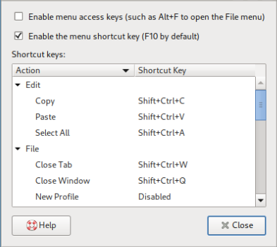

## ntvdm - An NT Virtual DOS Machine. 

Not the real one, but this one can be compiled and executed on Windows 
(x64 and ARM64), Linux (ARM32, ARM64, RISC-V, x64 and x32), and MacOS (tested with an M1).

I wrote it so I could test my [BASIC](https://github.com/davidly/ttt/blob/main/ba.cxx) compiler and it emulates an Intel 8086
processor  and MS-DOS 3.00 APIs well enough to be able to run some  command
line and text mode applications. 

There  are many better DOS emulators available, including [DOSBox](https://www.dosbox.com/), but  what
makes this one different is that it provides a way to run a DOS application
directly from the command line or shell/batch script in the current console
window.

The  emulator will work with applications that hook interrupts via the  DOS
mechanism or by directly writing to memory. This includes support for  int9
and int0x1c in applications like Microsoft QuickBasic and Brief Editor.  
However it does not provide support for graphics, sound, mouse, or anything
else that is not needed for simple text-mode apps.

It also includes a disassembler that is used when tracing program execution
which is useful when debugging why apps don't work properly.

The  performance of the 8086 processor emulation is about the same as other
emulators  written  in C/C++, and is about 30% faster than DOSBox  for  the
tic-tac-toe benchmark written in 8086 assembler.

I can't vouch for 100% 8086 emulation because I can't find any applications
that perform such validation, unlike the 6502, 8080, Z80, and other earlier
CPUs that have validation suites.  But I have done a fair bit of testing of
different  applications  and compared instruction and register traces  with
other emulators.

The emulator can simulate running at a given clock rate, however the number
of cycles needed for each instruction varies widely between various sources
and the code doesn't check for misaligned memory access, not get details of
mult/div operations correct, so the results are only an aproximatiion. 

Using mips version 1.20 (a benchmark application from 1986 written by Chips
and Technologies) then if the clock is set to /s:4500000 (4.5 Mhz) the 8086
emulator runs at about the same speed an actual 8088 running at 4.77Mhz.

Given  the  wide variability online regarding the  performance  differences
between the 8088 and 8086 (5%-50%) this seems quite close. 

### Applications Tested

 * Microsoft Macro Assembler Version 1.10
 * Microsoft Link Version 2.00
 * DEBUG 2.0 (Breakpoints and single-stepping tested).
 * GWBASIC
 * Microsoft QuickBasic 1.1
 * Microsoft QuickBasic 7.1 (Including Microsoft Basic compiler 7.10)
 * Borland Brief 3.1. (Requires -k to be passed on the Brief command line)
 * WordStar Professional Release 4 for DOS
 * Microsoft 8086 Object Linker Version 3.01 (C) Copyright Microsoft Corp 1983, 1984, 1985
 * Microsoft C Compiler Version 1.04 & Microsoft Object Linker Version 1.10 (1981)
 * Microsoft C Compiler Version 2.03 & Microsoft Object Linker Version 2.40 (1983)
 * Microsoft C Compiler Version 3.00 (1984, 1985)
 * Microsoft Segmented-Executable Linker 5.10 
 * Aztec (CG65 Version 3.2c ) cross-compiler (1989)
 * Turbo Pascal Version 1.00A, 3.02A, 5.5, and 7.0. (Debugger)
 * Turbo Basic Version 1.1 
 * Turbo C Version1.0 and 2.0 (Including debug breakpoints and single-stepping)
 * Turbo Assembler Version 3.2
 * Turbo Link Version 2.0
 * Microsoft Quick C Version 1.0 & 1.01. (Compiling, editing, breakpoints, single-stepping, etc). Requires -h flag
 * Microsoft Quick C Version 2.01 and v2.51 (Incremental linking must be is disabled). Requires -h flag
   * ilink.exe reads memory control blocks, which don't exist, so use link.exe instead.
 * Microsoft Quick Pascal Version 1.0
 * Microsoft Word Version 6.0 for DOS. (Set view / preferences / cursor control / speed to 0 to avoid key repeats).
 * Microsoft Works Version 3.0 for DOS.
 * Lotus 1-2-3 Release 1A
 * PC-LISP V3.00
 * LOGITECH MODULA-2 Compiler, DOS, Rel. 3.40, Mar 90
 * muLISP v5.10 interpreter (released by Microsoft). 
 * IBM Personal Computer Pascal Compiler Version 2.00 (generated apps require 8086 hma address wrapping)
 * Microsoft COBOL Compiler Version 5.0 (compiler and generated apps). Linker requires 286 but QBX's linker works fine.
 * Digital Research PL/I-86 Compiler Version 1.0, link86, and generated apps.
 * Microsoft FORTRAN77, the linker, and generated apps.
 * Microsoft (R) C Optimizing Compiler Version 5.10 with Microsoft (R) Overlay Linker  Version 3.65
 * Microsoft Pascal v1.10 (this requires using ntvdm's -h flag due to bugs in pas2.exe and generated apps)
 * Digital Research CB-86 v2.0 BASIC compiler. Note that this compiler requires source files be 0x1a / ^z terminated.
 * Mark Williams Company MWC86 Let's C Version 3.1.1 and Version 4.0.124.0.12

### Software

The  repository includes a several folders containing copies of old  MS-DOS
programs that were used to test the emulator.

 * *gwbasic* contains GWBasic 3.22
 
 * *msc_v3* contains Microsoft C Compiler Version 3.00 and command.c, a greatly
simplified replacement for command.com that can be built with that compiler. It's handy
for when apps like WordStar and QBX shell out to command.com.

 * *turbodos* contains Turbo Pascal 1.00A
 
 * *turbo3dos* contains Turbo Pascal 3.
 
 * *qbx* contains Quick Basic 7.1
 
 * *wordstar* contains WordStar Professional Release 4
 
 * *tasm* contains Turbo Assembler and several assembly language routines for
various interrupts. mint.bat generates the machine code in C arrays that are copied
into ntvdm.cxx and loaded into DOS RAM at runtime.

A number of compilers, assemblers, and emulators along with sample benchmark apps and build scripts for each can be found here: [dos_compilers](https://github.com/davidly/dos_compilers)

### Tested Platforms

The emulator has been compiled and tested on the following platforms:

 * Windows 11, Visual Studio 2022, x64

 * Windows 11, Visual Studio 2022, ARM64

 * MacOS on M1 and M3 MacBook Air, ARM64.

 * Debian 12 (Bookworm), g++ 12.2.0, x64

 * Debian 12 (Bookworm), g++ 12.2.0, x32

 * Debian 12 (Bookworm), g++ 12.2.0, RISC-V

 * Debian 10 (Buster), g++ 8.3.0, x64

 * Open SUSE Leap 15.4, g++ 7.5.0, x64
 
 * Ubutnu 20.04, gcc 9.4.0, x64 (WSL2)

 * Raspberry PI OS, g++, ARM64 and ARM32

### Windows

Build with m.bat or mr.bat for debug and release versions on Windows. Or build with g++ instead by using mg.bat or mgr.bat.

G++ versions are 20% faster than Microsoft C++ versions.

#### Usage

To display the command line options:
```
C:\> ntvdm -?
NT Virtual DOS Machine: emulates an 8086 MS-DOS 3.00 runtime environment enough to run COM/EXE apps
usage: ntvdm [arguments] <DOS executable> [arg1] [arg2]
  notes:
     -b               load/run program as the boot sector at 07c0:0000
     -c               tty mode. don't automatically make text area 80x25.
     -C               make text area 80x25 (not tty mode). also -C:43 -C:50
     -d               don't clear the display on exit
     -e:env,...       define environment variables.
     -h               load high above 64k and below 0xa0000.
     -i               trace instructions to ntvdm.log.
     -m               after the app ends, print video memory
     -p               show performance stats on exit.
     -r:root          root folder that maps to C:\
     -t               enable debug tracing to ntvdm.log
     -s:X             set processor speed in Hz.
                        for 4.77 MHz 8086 use -s:4770000.
                        for 4.77 MHz 8088 use -s:4500000.
     -v               output version information and exit.
     -?               output this help and exit.
```
To execute app.com with debuging output in ntvdm.log:
```
C:\>ntvdm -c -t app.com foo bar
```
To execute Turbo Pascal with am emulated clock speed of 4.77MHz:
```
C:\>ntvdm -s:4770000 turbo.com
```
To assemble and link a 'small' program:
```
C:\>ntvdm s:\github\MS-DOS\v2.0\bin\masm small,,,small
C:\>ntvdm s:\github\MS-DOS\v2.0\bin\link small,,,small
```
To execute a program and show the performance information on exit:
```
C:\>ntvdm -c -p ttt8086.com
    3.3 seconds
    moves: 6493
    iterations: 1000

    elapsed milliseconds:            3,331
    8086 cycles:             4,761,338,635
    clock rate:                  unbounded
    approx ms at 4.77Mhz:          998,184  == 0 days, 0 hours, 16 minutes, 38 seconds, 184 milliseconds
    unique first opcodes:               63
    app exit code:                       0
```

### Linux

 * The code assumes VT-100 support is available in your terminal window and
uses ASCII characters for instead of the MS-DOS code page 437 character set
which can be ugly. Anyone know how to enable codepage 437 on Linux?
 
 * Linux is case-sensitive and DOS isn't.  To minimize the potential issues
this causes you can force DOS to use UPPERCASE names by using `-u`.  If you
still  have problems use a seperate root directory for any DOS applications
with just uppercase directory and file names. The '-r' argument can be used
to specify a folder that maps to C:\. e.g. -r:. or -r:.. or -r:/this/that

 * Apps that use the Alt key generally work, but you will need to configure
the terminal application to disable menu access using the Alt key.

 * Most DOS applications require lines to end with CR/LF.  Ensure your input
files have this on Linux systems or appliations will fail in odd ways.

Usually View - Keyboard Shortcuts


 
 * Keyboard  handling adds some small (10ms) delays, which means  it  isn't
possible to paste text into an application.

#### Prerequisites

The following packages are required to build the emulator.

 * Debian : g++, libstdc++-8, libstdc++6

 * SUSE : gcc-c++
 
 * Ubuntu : g++, libstdc++-8, libstdc++6

#### Compiling

Release
```
g++ -ggdb -Ofast -fno-builtin -D NDEBUG -I . ntvdm.cxx i8086.cxx -o ntvdm -fopenmp
```
Debug 
```
g++ -ggdb -Og -fno-builtin -D DEBUG -I . ntvdm.cxx i8086.cxx -o ntvdm -fopenmp

```
#### Usage

To display the command line options:
```
$ ntvdm -?
Usage: ntvdm [OPTION]... PROGRAM [ARGUMENT]...
Emulates an 8086 and MS-DOS 3.00 runtime environment.

  -b               load/run program as the boot sector at 07c0:0000
  -c               tty mode. don't automatically make text area 80x25.
  -C               make text area 80x25 (not tty mode). also -C:43 -C:50
  -d               don't clear the display on exit
  -u               force DOS paths to be uppercase
  -l               force DOS paths to be lowercase
  -e:env,...       define environment variables.
  -h               load high above 64k and below 0xa0000.
  -i               trace instructions to ntvdm.log.
  -t               enable debug tracing to ntvdm.log
  -p               show performance stats on exit.
  -r:X             X is a folder that is mapped to C:\
  -s:X             set processor speed in Hz.
                     for 4.77 MHz 8086 use -s:4770000.
                     for 4.77 MHz 8088 use -s:4500000.
  -v               output version information and exit.
  -?               output this help and exit.
```
To compile and link the Microsoft C 3.0 demo application:
```
$ cd msc_v3
$ ../ntvdm -u -e:include=.\\inc msc.exe demo.c,,\;
$ ../ntvdm -u -e:lib=.\\lib link.exe demo,,\;
```
Note the use of the `-e` option to define the environment vairables used by
the  compiler and linker and the use of a `\` to escape any `\`  characters
in any DOS pathnames.

Running  the applicatiion with the same environment vairables defined  will
display  the application pathname, command line, arguments and environment
vairables used above.
```
$ ../ntvdm -u -e:include=.\\inc,lib=.\\lib demo.exe one two three
C:\msc_v3\DEMO.EXE
one
two
three
COMSPEC=COMMAND.COM
INCLUDE=.\INC
LIB=.\LIB
$
```
To run QuickBASIC.
```
$ cd qbx
$ ../ntvdm -u -r:. -C:50 qbx
```


QuickBASIC, like other apps on Linux, works best with -r:. and -u flags.

### 43 and 50 line modes

By default NTVDM runs in 25 line mode. Some DOS apps support 43 and 50 line mode
and others don't. Some apps like Quick Pascal have UI to change the line count,
and that just works. Other apps like Brief support more than 25 lines, but
require you use NTVDM's -C argument and Brief's line count argument to make
that work. For example:
```
    ntvdm -C:50 -r:.. b -L50 foo.txt
```
Many apps assume 25 lines and won't use more than that even with the -C:50 flag.

